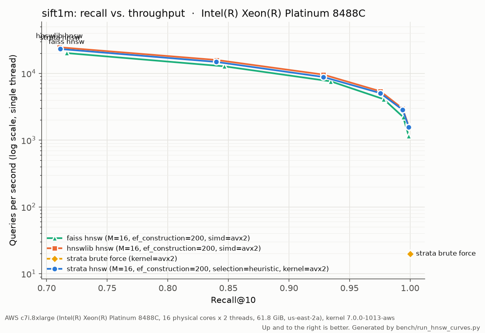

# Strata

A vector search engine written from scratch in C++20 (HNSW, SIMD distance kernels, product
quantization, filtered search, durable storage, gRPC sharding), with a retrieval-augmented
generation layer on top that answers questions from documents with cited sources.

Every number comes from a script in `bench/` that saves raw records (machine, commit, parameters)
and generates the linked table. Speed results come from a dedicated **AWS c7i.8xlarge** (Intel
Xeon Platinum 8488C, Sapphire Rapids; 16 physical cores), where results are final. Rows marked
*M2* are development results from a fanless MacBook Air: their recall is final, their speed
indicative. ARM results come from an **Oracle Cloud A1** machine (4 Arm Neoverse-N1 cores;
other workloads on that shared machine were paused during the runs).

## Results

**Strata against hnswlib and FAISS, like for like.** Same graph parameters (M=16,
ef_construction=200), one thread, and all three at 256-bit SIMD. Strata uses AVX2; FAISS is held
to AVX2 and hnswlib is built without AVX-512, each verified at run time. Recall@10 and queries per
second at ef_search=80:

| | Strata | hnswlib | FAISS |
|---|---:|---:|---:|
| SIFT1M: recall / QPS | 0.975 / 5,067 | 0.976 / **5,392** | 0.978 / 4,107 |
| GloVe-100: recall / QPS | 0.788 / **5,040** | 0.788 / 4,643 | 0.788 / 4,394 |
| BIGANN-10M: recall / QPS | 0.936 / 3,767 | 0.937 / **4,035** | 0.946 / 2,134 |
| SIFT1M build, single thread | **333 s** | 364 s | 493 s |

- **Where Strata stands:**
  - hnswlib leads by 6–7% on SIFT1M and BIGANN-10M.
  - Strata leads on GloVe-100 and builds SIFT1M fastest.
  - FAISS reaches slightly higher recall at the same ef_search, but answers 13–43% fewer queries
    per second than Strata.
- **The full curves** (ef_search 10–320, five runs per point):
  [SIFT1M and GloVe-100](results/hnsw/hnsw_vs_reference_x86.md), [10M](results/hnsw/hnsw_vs_reference_10m.md).
- **AVX-512 barely changes the picture.** With hnswlib and FAISS at AVX-512 (Strata has no
  AVX-512 kernels yet), FAISS gains 0–6%. hnswlib's AVX-512 build is *slower* than its AVX build on
  SIFT1M and BIGANN-10M, and faster only on GloVe-100 (5,185 QPS). Search is bound by memory
  latency, not vector width (see the profile row below).
  ([SIFT1M and GloVe-100](results/hnsw/hnsw_vs_reference_x86_avx512.md), [10M](results/hnsw/hnsw_vs_reference_10m_avx512.md))



| | result | source |
|---|---|---|
| Search thread scaling, SIFT1M, ef_search=80 | 5,238 → **75,353 QPS at 16 cores (14.4x, 90% efficient)**; 89,565 with 32 SMT threads | [table](results/search_scaling/scaling_sift1m.md) |
| Parallel HNSW build, SIFT1M | 322 s → **21 s with 16 threads (15.3x)**, same recall and graph statistics | [table](results/hnsw_build/build_scaling_sift1m.md) |
| **ARM** (Oracle A1, NEON), SIFT1M, ef_search=80 | Strata **4,455 QPS** @ 0.975 vs FAISS 4,034 @ 0.978 (both NEON) vs hnswlib 1,971 (no NEON path, scalar); build **431 s** vs 584 s / 1,065 s | [table](results/hnsw/hnsw_vs_reference_arm.md) |
| **ARM** thread scaling, 4 cores | search **3.4x** (85% efficient), build 433 s → 131 s (**3.3x**), same recall | [search](results/search_scaling/scaling_sift1m-arm.md), [build](results/hnsw_build/build_scaling_sift1m-arm.md) |
| Where search time goes (`perf`, SIFT1M) | `search_layer`'s traversal **54%** of cycles, the AVX2 distance kernel **33%**; **~0.55 instructions per cycle**: memory-latency bound | [profiles](results/profiles/aws/) |
| Filtered search: pre-filter vs graph crossover | **0.5% (random filters) to 1.5% (correlated)** at 1M; **below 0.1% to 0.9%** at 10M. Auto picks per filter and falls back on a budget | [1M](results/hnsw_filter/filter_sift1m.md), [10M](results/hnsw_filter/filter_bigann10m.md) |
| Sharded search over separate machines (SIFT1M, TLS on every hop, client on its own machine) | Loading 1M vectors scales: **345 s → 174 s → 72 s** on 1 / 2 / 4 shards. Query capacity does not: **8.0k → 8.6k → 9.9k QPS**. Every query visits every shard, and the bottleneck in this setup was not isolated. Latency is flat across shard counts: p99 **1.4 ms** at half load, about 2.5 ms per query one at a time. Recall at ef_search=64 rises with shard count (0.964 → 0.989): each shard returns its own top-k | [table](results/server/sharding_aws.md) |
| Snapshot load vs rebuild, 200k vectors (*M2*) | **0.39 s** vs 25.6 s | [table](results/storage/hnsw_persist_sift1m-200k-q1000.md) |
| Product quantization, SIFT10K, m=16 (*M2*) | **17.6x** smaller index; recall@10 0.996 re-ranking 50 candidates | [design §5](docs/design.md#5-compression-product-quantization) |
| SIMD, brute force on SIFT1M (*M2*) | NEON **9.2x** faster than scalar | [tables](results/tables.md) |
| Sharded search, async fan-out vs thread per shard (*M2*) | median latency **−8% / −10%** (2 / 4 shards); throughput **+17% / +23%** with 8 clients | [table](results/server/coordinator_latency_sift1m-200k-q1000.md) |
| Hybrid retrieval, HotpotQA (5.2M passages) | nDCG@10: BM25 0.633 (matches Anserini), dense 0.699, **RRF 0.730** | [RAG results](docs/rag-results.md) |
| Multi-hop QA, HotpotQA subset | answer F1 0.517 → **0.669** with joint two-hop reranking (gold passages: 0.739) | [RAG results](docs/rag-results.md) |

## How it fits together

```
                 Python: bindings (nanobind), RAG layer (BM25 + dense RRF, rerank, Claude answers)
                                   │
 client ──gRPC/TLS──► coordinator ─┼─► shard 0: Collection ─► HnswIndex | BruteForceIndex
                      (scatter,    ├─► shard 1:   ├─ WAL (every write, CRC'd, LSN-ordered)
                       merge top-k)└─► shard N:   └─ snapshot (atomic, versioned)
                                                  distance kernels: scalar | NEON | AVX2
```

- **[`docs/design.md`](docs/design.md):** the design choices and trade-offs (graph parameters,
  compression, filtering strategies, sharding, storage), with the numbers behind them.
- **[`docs/explainers/hnsw.md`](docs/explainers/hnsw.md):** the HNSW core, function by function.
- **[`docs/devlog.md`](docs/devlog.md):** decisions and what went wrong, in order.
- **[`buildplan.md`](buildplan.md):** the roadmap.

## Build

Requirements: CMake ≥ 3.25, Ninja, a C++20 compiler (Apple clang 15+ or GCC 12+/Clang 16+), and
[vcpkg](https://github.com/microsoft/vcpkg). Dependencies (GoogleTest, Google Benchmark) are pinned
in `vcpkg.json` and installed automatically on first configure.

```sh
# one-time vcpkg setup
git clone https://github.com/microsoft/vcpkg.git ~/vcpkg
~/vcpkg/bootstrap-vcpkg.sh -disableMetrics
export VCPKG_ROOT=~/vcpkg   # add to your shell profile

# configure, build, test
cmake --preset debug
cmake --build --preset debug
ctest --preset debug
```

| Preset    | Build type | Notes                                                        |
|-----------|------------|--------------------------------------------------------------|
| `debug`   | Debug      | Day-to-day development                                       |
| `release` | Release    | Benchmarks                                                   |
| `asan`    | Debug      | AddressSanitizer + UndefinedBehaviorSanitizer; run before committing memory-handling changes |
| `tsan`    | Debug      | ThreadSanitizer; run before committing concurrency changes   |
| `rosetta-avx2` | Debug | macOS only: x86_64 + AVX2 build run under Rosetta 2, to test AVX2 kernels on a Mac (correctness only, never timing) |
| `linux-debug`, `linux-release`, `linux-asan`, `linux-tsan` | as above | Linux only: the same builds with GCC 13 (`/usr/bin/g++-13`) |
| `linux-profile` | Release | Linux only: release flags plus `-g -fno-omit-frame-pointer`, for `perf` call graphs |

Build output goes to `build/<preset>/`.

### gRPC server and sharding coordinator (optional)

The server (`strata_shard`, `strata_coordinator`) is off by default (`STRATA_BUILD_SERVER`), so the
core library builds without gRPC. Its presets build everything above plus the server and its tests.

```sh
# macOS: gRPC and protobuf come from Homebrew (vcpkg's gRPC build is too heavy for the dev laptop)
brew install grpc protobuf abseil
cmake --preset server && cmake --build --preset server && ctest --preset server

# Linux: gRPC and protobuf come from vcpkg (manifest feature "server")
cmake --preset linux-server && cmake --build --preset linux-server && ctest --preset linux-server
```

| Preset | Build type | Notes |
|--------|------------|-------|
| `server` | Debug | macOS only: gRPC/protobuf/abseil from Homebrew (`/opt/homebrew`) |
| `server-release` | Release | macOS only: as above; for `bench/run_coordinator_bench.py` |
| `server-asan` | Debug | macOS only: as above with ASan + UBSan. The server tests run with `detect_container_overflow=0`: protobuf's container annotations give false positives when protobuf itself is not ASan-built |
| `linux-server`, `linux-server-release`, `linux-server-asan` | as named | Linux only: gRPC/protobuf from the vcpkg manifest, GCC 13 |

Homebrew and vcpkg can ship different gRPC and protobuf versions; both binaries print the versions
they were built against on startup. There is no ThreadSanitizer server preset: protobuf changes
its message layout under TSan, so TSan needs gRPC and protobuf built with TSan as well (a vcpkg
sanitizer triplet).

```sh
# two shards and a coordinator on one machine (all three listen on 127.0.0.1 only)
build/server/server/strata_shard --dir /tmp/s0 --dim 128 --port 50051 &
build/server/server/strata_shard --dir /tmp/s1 --dim 128 --port 50052 &
build/server/server/strata_coordinator --dim 128 --port 50050 --shard localhost:50051 --shard localhost:50052
```

For three shards and a coordinator in Docker Compose, with TLS and a token on every hop and each
shard's data in its own volume, see [`deploy/docker/README.md`](deploy/docker/README.md).

#### Securing the server

Both binaries listen on `127.0.0.1` by default, so nothing off the machine can reach them.
`--listen <host>` (e.g. `0.0.0.0`) exposes one, and then it must also have TLS and a shared token,
or it refuses to start unless given `--insecure`. TLS encrypts the traffic and proves the server's
identity; the token proves the caller's, since anyone who can open a connection could otherwise
insert and delete. A token is refused without TLS, because it would travel in plain text.

```sh
# one-time: a private CA, a server certificate naming every shard host, and a token
scripts/make_dev_certs.sh certs DNS:shard1.internal DNS:shard2.internal IP:10.0.0.5

# on each shard host
strata_shard --dir /data/s0 --dim 128 --listen 0.0.0.0 --port 50051 \
  --tls-cert certs/server.pem --tls-key certs/server.key --token-file certs/token

# the coordinator: TLS + token to the shards (the --shard host must be in the certificate)
strata_coordinator --dim 128 --shard shard1.internal:50051 --shard shard2.internal:50051 \
  --shard-ca certs/ca.pem --shard-token-file certs/token
```

The coordinator's own client-facing port takes the same `--listen`/`--tls-cert`/`--tls-key`/
`--token-file` flags. Keep `ca.key` off the servers (it only signs certificates) and `server.key`
and `token` readable only by the service account; the script creates them mode 600. Both
binaries print `plaintext`, `tls`, or `tls+token` in their startup line. `--max-threads` caps the
gRPC server's threads, and `--shard-timeout-ms` (default 10000) is the coordinator's deadline for
each call to a shard.

#### Limits and failure behavior

- **Ids are 32-bit.** With N shards, each shard holds at most about 4.29 billion / N vectors; an
  insert past that fails with `RESOURCE_EXHAUSTED` rather than wrapping around. `4294967295` is
  reserved and never an id.
- **`InsertBatch` is not atomic across shards.** When one shard fails, the others' inserts stand.
  The call returns OK with `error_code` set, and `ids` holds each input's id, or `4294967295` for
  inputs not inserted. To finish the batch, resend it with `ids` set to that list: inputs that
  already have an id are checked against the stored vector, not inserted again, so the retry is
  idempotent and can be repeated until `error_code` is 0. Don't run two retries of the same batch
  at once. One gap remains: if a shard inserted vectors but its reply was lost (a timeout), they
  are reported as not inserted, and a retry inserts them again under new ids.
- **Shard order is fixed.** A shard's position in the `--shard` list is part of every id it
  produced, so the list must stay the same across coordinator restarts.

## Python

The bindings (nanobind, built by scikit-build-core) expose brute-force search, product
quantization, filtered search, and the distance kernels. `VCPKG_ROOT` must be set. On Linux the
module is built with `/usr/bin/g++-13` when it is installed (matching the `linux-*` presets); to
use another compiler, pass `-C cmake.define.CMAKE_CXX_COMPILER=...` to pip (`CXX` is not used,
since build frontends always set it). An existing `build/python/` keeps the compiler recorded in
its CMake cache; delete it to switch.

```sh
python3.11 -m venv .venv && source .venv/bin/activate   # or: uv venv --python 3.11
pip install -e .                  # re-run after changing C++; the build is incremental
python -c "import strata; print(strata.build_info())"
```

```python
import numpy as np
import strata

base = np.random.default_rng(0).standard_normal((10_000, 128), dtype=np.float32)
queries = base[:5] + 0.01

# Exact search. float32 C-contiguous arrays are used without copying.
index = strata.BruteForceIndex(dim=128, metric="l2")
index.add(base)
ids, dists = index.search_batch(queries, k=10)        # (5, 10) each; GIL released

# Product quantization: 16 bytes per vector, exact rerank of the top 100.
pq = strata.ProductQuantizer.train(base, m=16)
pq_index = strata.PqIndex(pq)
pq_index.add(base)
ids, dists = pq_index.search(queries, k=10, rerank=100)

# Filtered search over metadata.
table = strata.AttributeTable([("year", "int"), ("source", "category")])
table.extend([[2015 + i % 10, ["arxiv", "blog"][i % 2]] for i in range(len(base))])
recent_arxiv = (strata.Filter.range("year", 2020, 2024)
                & strata.Filter.equals("source", "arxiv")).compile(table)
ids, dists = index.search_filtered(queries, k=10, filter=recent_arxiv)
```

```python
# Keyword search: BM25 scored exactly as Lucene/Anserini (k1=0.9, b=0.4 by default).
bm25 = strata.Bm25Index()                     # Analyzer.anserini_english() by default
bm25.add(["Aspirin lowers the risk of stroke", "Statins and cholesterol"])
ids, scores = bm25.search("does aspirin reduce strokes", k=10)
strata.Analyzer.anserini_english().analyze("John's running")   # ['john', 'run']

# BM25 and vector indexes share one id space: add document i to both in the same order.
# HybridIndex does that for you and fuses the results.
hybrid = strata.HybridIndex(dim=128, metric="cosine")
hybrid.add(["doc-a", "doc-b"], ["aspirin and stroke", "statins"], base[:2])
docs, scores = hybrid.search_doc_ids(["aspirin"], queries[:1], k=2, method="rrf")
```

- Results are `(ids, distances)`; missing results (fewer than k matches) are id `-1`,
  distance `inf`. BM25 returns `(ids, scores)` (higher is better; missing: `-1`, `-inf`).
- Other dtypes/layouts (float64, slices) are converted with one copy.
- Searches release the GIL and share the index's lock, so Python threads search in parallel.
  `add()`/`remove()` take the lock exclusively: inserts are serialized.
- `strata.HnswIndex` raises `NotImplementedError` until `src/index/hnsw.cpp` exists; then it
  switches on at the next `pip install -e .`.
- `strata.build_info()` reports the kernel, compiler, and floating-point flags. The binding
  tests compare against the C++ build bit for bit when these match, and within a relative
  tolerance of 1e-5 when they don't (`tests/python/test_bindings.py`).

## RAG: cited answers

`rag/answer.py` answers questions from retrieved passages with Claude (`claude-haiku-4-5`,
temperature 0). Each passage is sent as a document of sentences with citations enabled, so every
claim comes back with the exact sentences that support it. Responses are cached on disk by
request hash, so re-running an evaluation is free and reproducible.

```sh
cp .env.example .env            # then set ANTHROPIC_API_KEY (the file is gitignored)
# BEIR setting (retrieval over BEIR passages). Subset on the Mac; full 5.2M corpus via kaggle/.
uv run python scripts/prepare_hotpotqa_beir.py --n 100 --seed 0 --background 20000
uv run python bench/eval_hotpotqa_beir.py                          # cost estimate only
uv run python bench/eval_hotpotqa_beir.py --run --max-cost-usd 1.25

# HotpotQA distractor setting (each question's own 10 paragraphs)
uv run python scripts/prepare_hotpotqa.py --n 100 --seed 0
uv run python bench/eval_hotpotqa.py --subset subset-n100-seed0
```

Retrieval methods compared (fused, union, cross-encoder reranking, two-hop, joint two-hop
reranking), with their quality, latency, and when to use each: `docs/rag-results.md`.

Headline results (details and caveats in that doc):

| | Result |
|---|---|
| Full BEIR HotpotQA (5.2M passages) | BM25 nDCG@10 0.6329 (Anserini: 0.633), dense 0.6993 (published: 0.69935), **RRF 0.7297** |
| HotpotQA subset, answer F1 | fused 0.517 → joint two-hop bge rerank 0.669 (gold passages: 0.739) |
| SciFact reranking | no gain: bge nDCG@10 0.727 = fused 0.727 |
| Reranking latency, M2 CPU → T4 GPU | bge 3029 → 688 ms, MiniLM 231 → 47 ms per query (different machines) |

GPU stages (full-corpus retrieval, SciFact reranking, GPU latency) run in a Kaggle notebook;
see `kaggle/README.md`.

## Datasets

Python tooling uses [uv](https://docs.astral.sh/uv/) with Python 3.11.

```sh
uv sync                        # builds the strata package too (needs VCPKG_ROOT)
uv run python scripts/prepare_datasets.py siftsmall       # SIFT10K, ~5 MB
uv run python scripts/prepare_datasets.py sift1m glove100 # ~500 MB and ~460 MB downloads
uv run python scripts/prepare_datasets.py bigann10m      # BIGANN-10M: 1.3 GB download, 5.1 GB
make test-python     # env -u PYTHONPATH PYTEST_DISABLE_PLUGIN_AUTOLOAD=1 uv run pytest
```

Datasets are written to `data/<name>/` (gitignored) as `base.fbin`, `query.fbin`,
`groundtruth.ibin`, and `meta.json`. The binary format is a little-endian `uint32` header
`(num_vectors, dimension)` followed by row-major `float32` or `int32` values.

## Benchmarks

Every number comes from a script that saves raw JSON (with commit, hardware, and parameters) under
`results/`, and tables are generated from those files.

```sh
cmake --build --preset release
uv run python bench/run_search_bench.py --dataset siftsmall --index brute_force
uv run python bench/run_search_bench.py --dataset siftsmall --index hnsw --M 16 --ef-construction 200
uv run python bench/run_reference_bench.py --dataset siftsmall --library hnswlib
uv run python bench/run_reference_bench.py --dataset siftsmall --library faiss --index hnsw
uv run python bench/run_reference_bench.py --dataset siftsmall --library faiss --index flat
uv run python bench/run_search_bench.py --dataset siftsmall --kernel scalar   # without SIMD
uv run python bench/run_search_bench.py --dataset siftsmall --threads 4        # throughput mode
uv run python bench/run_search_bench.py --dataset siftsmall --index pq --pq-m 16   # rerank sweep
uv run python bench/run_storage_bench.py --dataset siftsmall   # WAL, checkpoint, recovery
uv run python bench/run_filter_bench.py --dataset siftsmall    # filtered search by selectivity
uv run python scripts/prepare_beir.py scifact
uv run python bench/validate_bm25_beir.py --dataset scifact    # reproduces Anserini's BM25
uv sync --group embed                                           # sentence-transformers + torch
uv run python scripts/embed_beir.py --dataset scifact --model bge-small-en-v1.5
uv run python bench/eval_hybrid_beir.py --dataset scifact      # BM25 / dense / RRF / weighted
uv run python bench/run_micro_bench.py --repetitions 5
uv run python bench/make_tables.py        # writes results/tables.md
uv run python bench/plot_recall_qps.py    # writes results/plots/recall_qps_<dataset>.png
uv run python bench/plot_pq_memory.py     # writes results/plots/pq_memory_<dataset>.png
uv run python bench/plot_filter.py        # writes results/plots/filter_<dataset>.png

# HNSW suites (each writes raw JSON plus a generated table; see each script's docstring)
uv run python bench/run_hnsw_curves.py --datasets siftsmall sift1m   # vs hnswlib and FAISS
uv run python bench/run_hnsw_build_scaling.py --threads 1,2,4        # parallel build
uv run python bench/run_search_scaling.py --threads 1,2,4,8          # search thread scaling
uv run python bench/run_hnsw_filter_bench.py                         # filtered-search crossover
uv run python bench/run_hnsw_delete_bench.py                         # recall under deletion
uv run python bench/run_hnsw_persist_bench.py                        # snapshot save/load

# Server (server-release preset)
uv run python bench/run_coordinator_bench.py --shards 2 4            # async vs thread fan-out
uv run python bench/run_sharding_bench.py --help                     # multi-machine (aws/)
```

The final x86 runs, the 10M run, thread scaling to 16 cores, and multi-machine sharding run in
one AWS session: plan and costs in [`docs/aws-plan.md`](docs/aws-plan.md), runbook in
[`aws/README.md`](aws/README.md).
